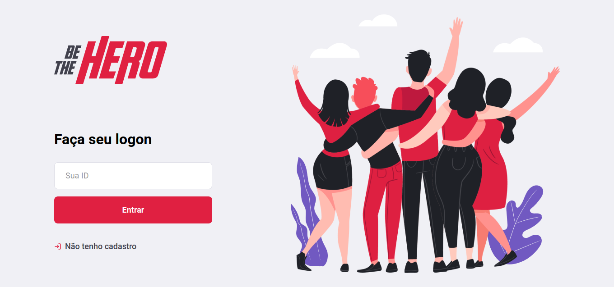

  

## Projeto feito em Nodejs no backend, Reactjs no frontend e React Native no mobile da semana Omministack 11 da Rocketseat.

A intenção do sitema e unir foças de ONGs, Instituições e sociedade que tenham interece em ajudar a cuidar dos animais em estádo de abandono, que sofreram acidentes ou que simplesmente precisem de um lar. 

  
  

  

Esse projeto inclui um app para que as pessoas intereçadas em ajudar podem fazer uso do aplicativo para analizarem a lista de 
casos e se decidrem ajudar, entrarão em contato com as ONGs por meio do telefone ou pelo WhatsApp.

    

    

  

Durante a semana tive a oporunidade de conhecer o JavaScrip no backend contruido em nodejs com o gerenciador de arquivos npm, 
foram utilizados várias modulos

## Tecnologias

- Node.js
- React.js
- React native
- Expo
- Express
- Nodemon
- Axios
- Cors
- SQLite3
- Jest

## Back-End

- Execute o `nmp` na pasta` back-end`;
- Execute `npm start` para atualizar o servidor;
- Abra o Insomnia ou Postman e importe o arquivo do espaço de trabalho Insomnia.json na pasta do servidor.

## Front-End

- Execute `yarn` na pasta` frontend`;
- Execute o `yarn start` para atualizar o projeto;

## Mobile

- Execute `yarn` na pasta` mobile`;
- Atualize a baseURL em src / services / api.js.
- Execute o `expo start` para atualizar o projeto.

## Teste

- Execute `yarn test: backend` na pasta de back-end;

# Licença
[Licença MIT] (/ LICENSE)
